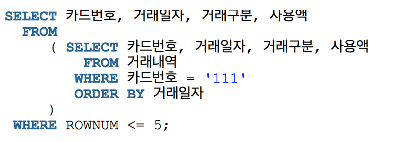
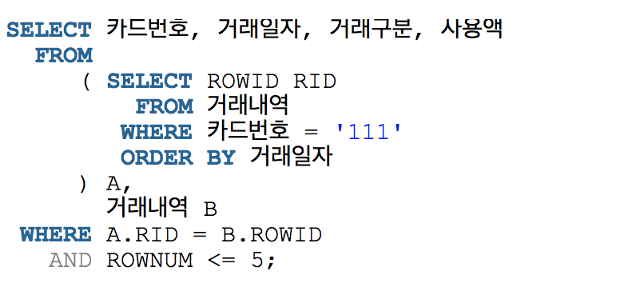

# 결합칼럼 인덱스와 단일칼럼 인덱스
> http://www.gurubee.net/expert/kwontra 를 읽고 정리한 글

## SQL의 성능은 처리범위에 좌우된다
읽는 block의 수가 적어야한다

읽는 block의 수를 줄이기 위해서는 인덱스를 잘 구성해야 한다

1. block의 수 : 결합 칼럼 인덱스 < 단일 칼럼 인덱스
2. 결합인덱스 구성시 고려해야 하는 순서
    1. 칼럼이 사용한 연산자에 의한 칼럼 선정
    2. 랜덤 엑세스를 고려한 인덱스 칼럼 선정
        1. 확인 랜덤 엑세스
            1. where, having 조건의 칼럼이 인덱스에 없어서 발생
            2. 결과와 같거나 더 많은 데이터를 랜덤 엑세스
            3. 인덱스 조정이 필요 (새로 만들거나..기존의 것에 추가하거나)
        2. 추출 랜덤 엑세스
            1. select 절의 칼럼이 index에 없어서 발생
            2. 결과와 같은 데이터를 랜덤 엑세스
            3. 다음과 같은 쿼리 변경으로 추출 랜덤 엑세스를 줄일 수 있다
                1. 
                    1. 카드번호=1111이 1000건이라면 인라인뷰는 1000번의 랜덤 엑세스 발생
                2.  
                    1. 5번의 랜덤 엑세스 발생
                    2. rowid 는 index에 존재
        3. 정렬 랜덤 엑세스
            1. order by, group by 절의 칼럼이 index에 없어서 발생
            2. 결과와 같은 데이터를 랜덤 엑세스
            3. 정렬 칼럼을 인덱스의 끝에 추가
            4. 정렬된 데이터는 어디 존재 하는가
                1. 테이블
                    1. insert 순서로 저장되기 때문에 정렬된 데이터가 존재할 수 없다.
                2. 인덱스
                    1. 인덱스 조건의 순서에 따라 정렬된 데이터로 존재한다
                    2. 정렬하고자 하는 조건의 순서가 인덱스의 조건 순서와 같다면 order by 절을 넣지 않아도 된다
    3. 정렬 제거를 위한 인덱스 칼럼 선정
    4. 단일 칼럼의 분포도를 고려한 인덱스 칼럼 선정
        1. 분포도에는. 함정이 있고, 무조건 분포도가 좋은 칼럼을 앞 조건으로 선택해서는 안된다 (분포도라는 것은 = 로 조회할때만 유효)
        2. 점 조건 + 점. 조건 : 두 조건에 의해 감소
        3. 점 조선 + 선분 조건 : 두 조건에 의해 감소
        4. 선분 조건 + 선분 조건 : 앞의 선분 조건에 의해 감소
        5. 선분 조건 + 점 조건 : 앞의 선분 조건에 의해서만 감소 

**선분조건 + 점조건 index일때 점조건이 처리범위를 감소시키지 못하는데는 index 의 생성원리에 있다**

**이는 정렬과 유사하여 선분조건이 앞에 오면 뒤의 점조건 (2차 정렬기준) 에서는 낱개로 검색할 수 밖에 없다**
